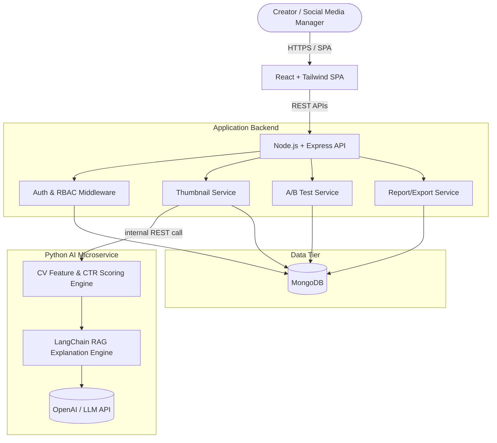
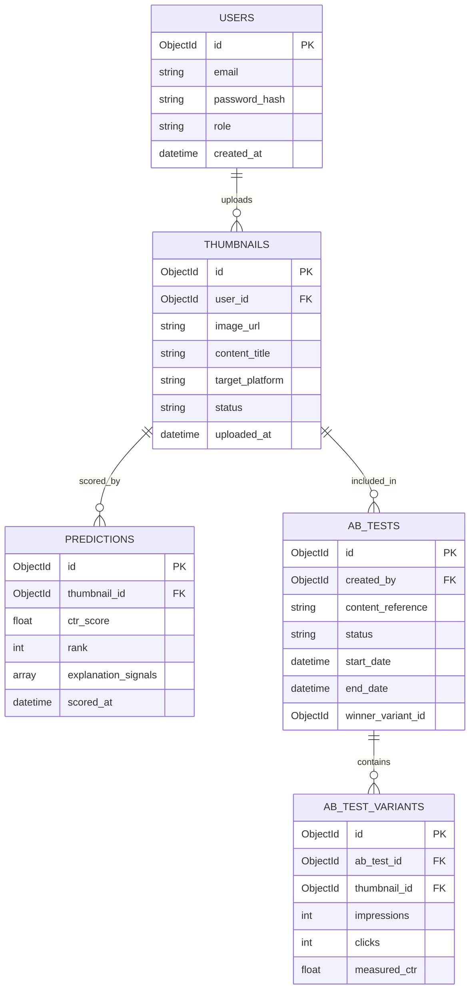

# Thumbnail Optimizer
## Product Requirements Document — Full Project Documentation

| Field | Value |
| :--- | :--- |
| **Name** | Arnab Boro |
| **Semester** | 5th |
| **Enrollment No.** | 240410700012 |
| **Track** | Multimodal AI (Computer Vision + LLM) |
| **Domain** | Content Creation |
| **Target Industry** | Media / Creator Economy |
| **Core Skills Exercised** | DSA, DBMS, Full-Stack Development |
| **Stack** | React + Node.js/Express + MongoDB (MERN) + Python (FastAPI/Flask) AI microservice + AI/LLM APIs |
| **Duration / Team / Level** | 6–8 Weeks (Multimodal AI track default) · Team Size 1–2 · Advanced |

> This is a single consolidated document covering all the standard project-documentation chapters — Business Requirements, Product Requirements, UX, Technical Requirements, High-Level & Low-Level Design, Database Design, API Specification, Multimodal AI Architecture, Security, Testing, CI/CD, Cost/Roadmap/Team, Repository Structure, and ADRs/Traceability/Interview Prep — written specifically for the **Thumbnail Optimizer** project, following the same structure used across the reference documentation set for this OJT track.

---

## 0. Project Overview

The **Thumbnail Optimizer** helps content creators, influencers, and social media managers predict how well a candidate thumbnail will perform — before it ever goes live. Creators upload two or more candidate thumbnails for a piece of content; the system extracts visual (and where available, text) signals from each image, produces a predicted click-through-rate (CTR) ranking with a plain-language explanation, and lets the creator launch a structured A/B test to confirm the prediction against real audience engagement. Everything is delivered as a deployed, full-stack MERN + Python AI application — authentication, REST API, interactive dashboard, and reporting included — not a research notebook.

```
        ┌────────────────────────────────────────────────────────┐
        │        CONTENT CREATOR / SOCIAL MEDIA MANAGER           │
        └───────────────────────────┬────────────────────────────┘
                                     │
                 ┌───────────────────▼───────────────────┐
                 │   REACT + TAILWIND WEB DASHBOARD       │
                 └───────────────────┬───────────────────┘
                                     │ REST APIs
                 ┌───────────────────▼───────────────────┐
                 │   NODE.JS + EXPRESS APPLICATION API    │
                 └───────────┬───────────────┬───────────┘
                             │               │
              ┌──────────────┴──┐         ┌──┴───────────────────┐
              │ PYTHON AI SERVICE│         │   MONGODB            │
              │ - CV Feature/CTR │         │ - Users               │
              │   Scoring Engine │         │ - Thumbnails          │
              │ - LangChain RAG  │         │ - Predictions         │
              │   Explanation    │         │ - A/B Tests           │
              └──────────────────┘         └───────────────────────┘
```

---

## 1. Business Requirements Document (BRD)

### 1.1 Executive Summary
Content creators routinely lose views and revenue to thumbnails chosen on instinct rather than evidence, with no structured way to compare candidates before publishing and no closed feedback loop afterward. The **Thumbnail Optimizer** automates this decision: a computer-vision scoring engine ranks candidate thumbnails for predicted CTR and explains its reasoning, while a built-in A/B testing module lets creators validate that ranking against real audience data, closing the loop from prediction to evidence.

### 1.2 Problem Statement
* **Current State:** Creators and social media managers pick thumbnails subjectively — personal taste, a quick poll, or a platform's native A/B feature (where one exists) used inconsistently and after the fact.
* **Affected Stakeholders:** Independent content creators, influencers, social media managers/agencies, and — indirectly — the platforms and brands whose engagement depends on thumbnail performance.
* **Bottlenecks:** No pre-publish, objective way to compare candidates; feedback (if any) arrives only after the content is live, when switching thumbnails has limited upside; no standardized reporting for agencies to justify creative choices to clients.
* **Business Impact:** Since thumbnails are one of the largest single levers on CTR for video/social content, small, avoidable misses in thumbnail selection translate directly into lost views, lost watch time, and lost ad/sponsorship revenue at scale across a creator's catalog.

### 1.3 Vision
To give every creator — not just those with a data science team — an objective, fast, evidence-based way to pick the thumbnail most likely to get a click, replacing gut-feel and guesswork with a measurable, repeatable optimization loop.

### 1.4 Objectives (SMART)
* **Prediction Usefulness:** Achieve ≥ 75% directional accuracy — i.e., correctly identifying the higher-performing thumbnail out of a candidate set, measured against actual A/B test outcomes collected during the pilot.
* **Processing Latency:** Return CV-based CTR scores and explanations for a batch of up to 5 candidate thumbnails in under 5 seconds.
* **Time-to-Decision:** Reduce the time a creator spends deciding between thumbnail candidates by a meaningful margin (target: 70%) compared to unaided manual A/B guesswork, measured via pilot user feedback.

### 1.5 Target Personas
* **Persona 1 — Independent Content Creator / Influencer**
  * *Goals:* Maximize views/clicks on new uploads without hiring a designer or analyst; decide quickly between 2–4 thumbnail options before a post goes live.
  * *Pain Points:* No reliable way to A/B test before publishing; relies on subjective opinion or small, noisy comment-section feedback.
  * *Tech Skill:* Basic–intermediate web app user.
* **Persona 2 — Social Media Manager (agency / brand side)**
  * *Goals:* Standardize thumbnail quality across multiple client accounts; justify creative decisions with data; produce reports for clients.
  * *Pain Points:* Manages many accounts/campaigns at once; needs exportable evidence, not just a score on a screen.
  * *Tech Skill:* Intermediate; comfortable with dashboards and CSV/PDF exports.
* **Persona 3 — Platform / Team Admin**
  * *Goals:* Oversee usage and model performance across a team or organization's accounts.
  * *Tech Skill:* Intermediate–advanced.

### 1.6 User Journey
1. **Login & Dashboard Overview:** Creator logs into the web app; sees recent thumbnails, active A/B tests, and summary metrics.
2. **Candidate Upload:** Creator uploads 2+ candidate thumbnails for an upcoming post.
3. **Automated Scoring:** The Python AI service extracts visual features from each image, computes a predicted CTR score/rank, and generates a plain-language explanation via the RAG-grounded assistant.
4. **Decision or Test:** Creator either picks the top-ranked thumbnail directly, or launches a structured A/B test between the top candidates.
5. **Result Tracking & Report:** Engagement data is logged (manually or via a platform sync) until the test concludes; the system declares a winner, compares it to the original prediction, and the creator exports a report if needed.

### 1.7 Business Use Cases
* **UC-01:** Predict a relative CTR ranking across a set of candidate thumbnails.
* **UC-02:** Run a structured A/B test between thumbnail variants and record engagement outcomes.
* **UC-03:** Export a shareable, evidence-backed report (PDF/CSV) of a prediction and/or test result.

### 1.8 Functional Business Requirements

| Requirement ID | Requirement Description | Priority | Business Justification | Acceptance Criteria |
| :--- | :--- | :--- | :--- | :--- |
| **BR-001** | Multi-candidate thumbnail upload & CV-based CTR scoring | High | Core value proposition — objective, pre-publish comparison. | Accepts 2–10 images per batch (JPG/PNG/WEBP, ≤10MB each); returns a score/rank for each within 5 seconds. |
| **BR-002** | Explanation engine (visual signal breakdown) | High | Creators need to know *why*, not just a number, to improve future thumbnails. | Each score includes ≥1 concrete visual signal (contrast, face presence, text legibility, clutter, etc.). |
| **BR-003** | Structured A/B testing module | High | Closes the loop — validates predictions against real engagement, builds trust in the tool. | User can define variants, track metrics, and receive an automatically declared winner. |
| **BR-004** | Secure authentication & role-based access | High | Protects creator/agency data; supports agency team + admin use cases. | JWT-based auth; roles for Creator, Manager, Admin enforced on relevant endpoints. |
| **BR-005** | Reporting & export (PDF/CSV) | Medium | Agencies need to share evidence with clients. | Exports include thumbnail image(s), score, and test result where available. |

### 1.9 Non-Functional Business Requirements
* **Performance:** Dashboard loads in < 2s; CV scoring batch completes in < 5s.
* **Availability:** Target 99% uptime during a pilot's active usage hours.
* **Security:** Role-based access control ensures a Manager/Admin's team members only see data for accounts they're authorized on.

### 1.10 Success Metrics
* Directional prediction accuracy ≥ 75% against completed A/B tests.
* ≥ 70% reduction in reported time-to-decision for thumbnail selection among pilot users.
* All Must-Have features (§2.5) implemented, deployed, and demoable end-to-end by project completion.

### 1.11 Assumptions
* A workable thumbnail image + engagement dataset (sourced publicly or constructed during Phase 1) will be available to build and sanity-check the scoring model — see §9.3's adaptation note on the provided RAG/WikiQA references.
* A/B test engagement data is entered by the user or synced via a simple, manually-triggered integration — not a guaranteed live/real-time platform feed.

### 1.12 Constraints
* **Compute:** MVP inference is expected to run on CPU or a single modest GPU/free-tier cloud instance — no dedicated ML infrastructure budget.
* **Duration:** Fits the Multimodal AI track's standard 6–8 week project window.
* **Team:** Sized for 1–2 students; role split in §13.3 assumes 2 but collapses cleanly to a solo plan.

### 1.13 Risks & Mitigations

| Risk | Probability | Impact | Mitigation Strategy |
| :--- | :--- | :--- | :--- |
| No ready-made thumbnail-image + CTR dataset (the provided reference dataset, WikiQA, is text-only) | High | High | Source a public thumbnail/CTR dataset or construct a small proxy dataset in Phase 1; confirm choice with mentor before Phase 2. See §9.3. |
| CV/heuristic model's absolute accuracy is unproven at MVP stage | Medium | Medium | Frame output as a *relative ranking* rather than an absolute CTR percentage; let built-in A/B testing be the real validator (§1.7, UC-02). |
| LLM API cost/rate limits for explanation generation | Low | Medium | Cache explanations per thumbnail; fall back to a rule-based explanation template if the LLM call fails or is rate-limited. |

### 1.14 MVP Scope
* **In Scope:** CV-based CTR scoring & explanation engine; A/B testing module with manual/CSV-synced engagement data; JWT authentication with role-based access; MongoDB-backed data models; REST API; responsive React dashboard; PDF/CSV export.
* **Out of Scope (this build):** Fully automated live sync of impressions/clicks from external platforms; native mobile apps; multi-tenant billing/SaaS infrastructure; production-grade CI/CD and container orchestration (documented as a future extension, not required for MVP grading).

### 1.15 Future Scope
* Real-time analytics and live platform API sync for engagement data.
* Multi-tenant support for agencies managing many client accounts, with per-tenant billing.
* Mobile-friendly PWA packaging.
* Model drift monitoring as the scoring model is retrained on growing real A/B outcome data.

---

## 2. Product Requirements Document (PRD)

### 2.1 Product Vision & Goals
**Vision:** Give every creator — not just those with a data science team — an objective, fast, evidence-based way to pick the thumbnail most likely to get a click, replacing gut-feel and guesswork with a measurable optimization loop.

**Goals:**
* Predict relative CTR performance across a set of candidate thumbnails using computer vision.
* Let creators validate predictions with lightweight, built-in A/B testing rather than trusting the model blindly.
* Package the whole workflow (upload → predict → test → decide) behind secure authentication, a REST API, and an interactive dashboard, deployed as a real, usable full-stack product.

### 2.2 Target Users
See personas in §1.5 (Independent Creator/Influencer, Social Media Manager, Platform/Team Admin).

### 2.3 Problem & Opportunity
Thumbnails are one of the single biggest levers on click-through rate for video and social content, yet most creators pick them subjectively, with no structured feedback loop until long after the content is live. A tool that scores candidates before publishing, explains why, and closes the loop with real A/B data turns thumbnail selection from a guess into a repeatable, improvable process.

### 2.4 User Stories & Acceptance Criteria

**US-01: Thumbnail Upload & CTR Prediction**
* **As a** Content Creator, **I want to** upload one or more candidate thumbnail images for a piece of content, **so that** I can see a predicted CTR/performance score for each before publishing.
  * System accepts common image formats (JPG/PNG/WEBP) up to a defined size limit (e.g., 10 MB).
  * Each uploaded thumbnail returns a predicted CTR score (or relative rank among the batch) within a few seconds.
  * The score is accompanied by a plain-language explanation referencing at least one detected visual signal (e.g., "high contrast text", "clear focal face", "cluttered background").

**US-02: A/B Test Setup & Tracking**
* **As a** Social Media Manager, **I want to** launch a structured A/B test between two or more thumbnail variants for a live post, **so that** I can confirm the model's prediction against real audience engagement.
  * User can define a test (variants, target platform/content reference, start/end date).
  * System records and displays engagement metrics (impressions, clicks, CTR) entered or synced per variant.
  * At test completion, the system declares a statistically-reasoned winner and compares it to the original CV prediction.

**US-03: Secure Account & Access Management**
* **As a** registered User (Creator, Manager, or Admin), **I want to** sign up, log in, and manage my account securely, **so that** my thumbnails, tests, and results are private to me (or my team).
  * Passwords are hashed and never stored in plain text; sessions use JWT-based authentication.
  * Role-based access ensures Admin-only views (analytics panel) are hidden from standard users.
  * Failed logins are rate-limited; standard email/password validation is enforced on signup.

**US-04: Interactive Dashboard**
* **As a** Content Creator, **I want to** see all my past uploads, predictions, and test results in one dashboard, **so that** I can track what's worked and quickly start a new comparison.
  * Dashboard lists recent thumbnails/tests with status (predicted / testing / completed).
  * Dashboard loads in under 2 seconds under normal conditions.
  * Dashboard is responsive and usable on both desktop and mobile screen widths.

**US-05: Report Export (Should Have)**
* **As a** Social Media Manager, **I want to** export a thumbnail's prediction and A/B test results as a PDF or CSV, **so that** I can share evidence-backed recommendations with clients or my team.
  * Export includes thumbnail image(s), predicted score, and final A/B results if available.
  * PDF and CSV export options are both available from the dashboard.

**US-06: Developer / Third-Party API Access**
* **As a** Developer integrating with the platform, **I want to** call a documented REST API to submit thumbnails and retrieve predictions programmatically, **so that** I can plug thumbnail scoring into my own upload workflow or CMS.
  * API endpoints are authenticated (token-based) and documented (e.g., OpenAPI/Swagger).
  * API responses return prediction score, explanation signals, and request status in a consistent JSON schema.

### 2.5 Feature Priorities (MoSCoW)
* **Must Have:** CV-based CTR scoring engine, JWT authentication, REST API, interactive dashboard, A/B testing module, MongoDB data models.
* **Should Have:** Rich charts of prediction/test results, unit & integration tests, dark mode, PDF/CSV export, email notifications.
* **Could Have:** Admin analytics panel, real-time analytics updates, mobile PWA packaging, model drift monitoring.
* **Won't Have (this build):** Multi-tenant billing/SaaS hierarchy, native mobile apps, full CI/CD & container orchestration automation, live/real-time external-platform ingestion.

### 2.6 Non-Functional Requirements / Evaluation Criteria

| Requirement | Target |
| :--- | :--- |
| Dashboard Load Time | < 2 seconds |
| Authentication | Secure (hashed passwords, JWT sessions, rate limiting) |
| Data Integrity | CRUD operations on users/thumbnails/tests must be accurate and consistent |
| Reporting | PDF/CSV generation completes without data loss or formatting errors |
| UI | Fully responsive across desktop and mobile breakpoints |
| Prediction Consistency | Identical input thumbnail yields the same score on repeated calls (deterministic inference) |

---

## 3. UX Requirements

### 3.1 Information Architecture & Routing Structure
* `/dashboard` — Summary metrics (Total Thumbnails Scored, Active A/B Tests, Avg. Predicted CTR Lift, Reports Generated).
* `/thumbnails` — Searchable grid/table of uploaded thumbnails, filterable by status (Scored / Testing / Completed).
* `/thumbnails/:id/optimize` — Main workspace: candidate gallery, CV score panel, explanation panel.
* `/abtests` — Management table of running/completed A/B tests.
* `/abtests/:id` — Detail view: per-variant metrics, winner declaration.
* `/reports` — History of exported reports.
* `/admin/analytics` — Admin-only usage & model-performance panel (Could Have).

### 3.2 User Flow: Optimize & Test Flow
```
[Upload Candidates] ──► [CV Scoring & Explanation] ──► [Pick Favorite or Launch A/B Test]
                                                                     │
        [Export Report] ◄── [Winner Declared] ◄── [Track Engagement Over Test Window]
```

### 3.3 Screen Requirements: Optimize Workspace (`/thumbnails/:id/optimize`)
* **Purpose:** Compare candidate thumbnails, review CV-predicted scores and explanations, and decide or launch a test.
* **Components:**
  * Header panel with content metadata (title/caption, target platform, upload date).
  * Center gallery: candidate thumbnails with overlay score badges, sorted by predicted rank.
  * Right sidebar: explanation signals panel (contrast, face/text detection, clutter score) and a "Start A/B Test" button.
* **States:**
  * *Loading:* Skeleton loader during CV inference / explanation generation.
  * *Error:* Message shown if an image is corrupt, unsupported format, or the AI service is unreachable.
  * *Empty:* "No thumbnails uploaded yet for this item."

### 3.4 Accessibility & Responsive Design
* Contrast ratio ≥ 4.5:1 for all text elements, per WCAG 2.1 AA.
* Full keyboard navigation for upload, comparison, and test-creation controls.
* Responsive from common desktop resolutions (1920×1080) down to mobile widths, per the Responsive UI evaluation criterion.

---

## 4. Technical Requirements Document (TRD)

### 4.1 Technical Goals
* Build a lightweight, deployable full-stack system that pairs a Node/Express web-and-API layer with a Python microservice for CV/LLM work, matching the assignment's MERN + Python + AI/LLM APIs stack.
* Keep MVP inference latency low enough for an interactive, in-browser workflow (batch scoring in single-digit seconds).

### 4.2 Technology Selection & Rationale
* **Frontend: React + Tailwind CSS + Chart.js + Axios** — component-driven UI for the gallery/comparison workspace; Tailwind for rapid styling; Chart.js for prediction/test visualizations.
* **Application Backend: Node.js + Express** — handles authentication, REST API, business logic, and MongoDB access; keeps the web-facing layer in the MERN stack as specified.
* **AI Service: Python + FastAPI/Flask** — hosts the CV scoring engine and the LangChain/OpenAI-based explanation pipeline; called internally by the Express layer. Python is used here because the CV/ML and LLM tooling ecosystem is strongest there.
* **Database: MongoDB** — flexible document schema suits varied thumbnail metadata and evolving A/B test configurations; native fit for the MERN stack.
* **Auth: JWT** — stateless, simple to implement across the Express API and any third-party API consumers (US-06).

### 4.3 System Non-Functional Technical Targets
* **Model Inference Latency:** < 3s per image on CPU (target < 500ms if GPU-accelerated).
* **API Rate Limiting:** 60 requests/minute per authenticated user.
* **Database Query Performance:** Typical dashboard queries < 150ms.

### 4.4 Functional Technical Requirements Mapping

| Requirement ID | Technical Requirement | Architectural Mapping |
| :--- | :--- | :--- |
| **TR-001** | Asynchronous thumbnail upload & scoring without blocking HTTP threads. | Express background job / queue → internal call to Python AI service. |
| **TR-002** | Extract CV features and compute a CTR score/rank per thumbnail. | Python FastAPI service (OpenCV/PyTorch feature extraction + scoring model). |
| **TR-003** | Aggregate A/B test engagement metrics and determine a winner. | Node/Express `ABTestService` + MongoDB aggregation pipeline. |
| **TR-004** | Generate a grounded, plain-language explanation for a score. | LangChain RAG pipeline over a thumbnail best-practices knowledge base, via OpenAI SDK. |

---

## 5. High-Level Design (HLD)

### 5.1 System Architecture Diagram



### 5.2 Component Responsibilities
* **React SPA:** Upload UI, candidate comparison gallery, dashboard, A/B test management, report export triggers.
* **Express API:** Routing, authentication/RBAC, request validation, orchestration between MongoDB and the Python AI service, business logic for A/B winner determination.
* **Python AI Microservice:** CV feature extraction, CTR scoring, and the RAG-based explanation pipeline; stateless, called synchronously or via a lightweight job queue by the Express layer.
* **MongoDB:** Stores users, thumbnails, predictions, and A/B test documents (see §6).

### 5.3 Request Flow: Optimize & Test Pipeline
1. Creator uploads candidate thumbnails via the React SPA.
2. Express `ThumbnailService` stores metadata in MongoDB and forwards image data to the Python AI service.
3. The CV engine extracts visual features (contrast, face/text presence, clutter, color vividness) per image.
4. The scoring engine computes a predicted CTR score/rank per candidate.
5. The RAG explanation engine generates a plain-language rationale for each score, grounded in a thumbnail best-practices knowledge base.
6. Results are returned to Express, persisted against the `predictions` collection, and pushed to the dashboard.
7. If the creator launches an A/B test, `ABTestService` creates an `ab_tests` document referencing the chosen variants.
8. Engagement metrics are recorded (manual entry or synced) until the test window closes.
9. On close, `ABTestService` computes the winning variant and compares it against the original CV prediction for the accuracy metric in §1.10.

---

## 6. Database Design

### 6.1 Entity Relationship Diagram



### 6.2 Schema Specification

**Collection: `thumbnails`**

| Field | Type | Constraint | Description |
| :--- | :--- | :--- | :--- |
| `_id` | ObjectId | Primary Key | System identifier |
| `user_id` | ObjectId | Ref `users`, Not Null | Owner of the upload |
| `image_url` | String | Not Null | Stored image location |
| `content_title` | String | Optional | Video/post title or caption text |
| `target_platform` | String | Optional | e.g., YouTube, Instagram, TikTok |
| `status` | String | Default `'UPLOADED'` | `UPLOADED`, `SCORED`, `TESTING`, `COMPLETED` |
| `uploaded_at` | Date | Default `now()` | Upload timestamp |

**Collection: `ab_tests`**

| Field | Type | Constraint | Description |
| :--- | :--- | :--- | :--- |
| `_id` | ObjectId | Primary Key | Test identifier |
| `created_by` | ObjectId | Ref `users`, Not Null | Test owner |
| `content_reference` | String | Not Null | Link/identifier for the live post being tested |
| `status` | String | Default `'RUNNING'` | `RUNNING`, `COMPLETED`, `CANCELLED` |
| `start_date` / `end_date` | Date | Not Null | Test window |
| `winner_variant_id` | ObjectId | Nullable, Ref `ab_test_variants` | Set once the test concludes |

### 6.3 Indexing Strategy
* Index on `thumbnails.user_id` for fast per-user dashboard queries.
* Index on `ab_tests.status` for filtering active/completed tests.
* Compound index on `thumbnails.user_id` + `uploaded_at` (descending) for recent-uploads sorting on the dashboard.

---

## 7. API Specification

### 7.1 Upload Candidate Thumbnails
* **Endpoint:** `POST /api/v1/thumbnails/upload`
* **Authorization:** Bearer JWT (Roles: `Creator`, `Manager`, `Admin`)
* **Request:** `multipart/form-data` with one or more `files: UploadFile[]`
* **Response (202 Accepted):**
```json
{
  "thumbnail_ids": ["665f1a2b3c4d5e6f7a8b9c01", "665f1a2b3c4d5e6f7a8b9c02"],
  "status": "PROCESSING",
  "message": "Thumbnails uploaded successfully. Scoring job queued."
}
```

### 7.2 Trigger CTR Prediction
* **Endpoint:** `POST /api/v1/predictions/analyze`
* **Authorization:** Bearer JWT
* **Request Body:**
```json
{
  "thumbnail_ids": ["665f1a2b3c4d5e6f7a8b9c01", "665f1a2b3c4d5e6f7a8b9c02"]
}
```
* **Response (200 OK):**
```json
{
  "results": [
    {
      "thumbnail_id": "665f1a2b3c4d5e6f7a8b9c01",
      "ctr_score": 78.4,
      "rank": 1,
      "explanation_signals": ["high-contrast text", "clear focal face", "balanced composition"]
    },
    {
      "thumbnail_id": "665f1a2b3c4d5e6f7a8b9c02",
      "ctr_score": 61.2,
      "rank": 2,
      "explanation_signals": ["cluttered background", "low text legibility"]
    }
  ]
}
```

### 7.3 Create an A/B Test
* **Endpoint:** `POST /api/v1/abtests`
* **Authorization:** Bearer JWT (Roles: `Creator`, `Manager`, `Admin`)
* **Request Body:**
```json
{
  "content_reference": "youtube.com/watch?v=abc123",
  "variant_thumbnail_ids": ["665f1a2b3c4d5e6f7a8b9c01", "665f1a2b3c4d5e6f7a8b9c02"],
  "start_date": "2026-09-05",
  "end_date": "2026-09-12"
}
```
* **Response (201 Created):**
```json
{
  "ab_test_id": "665f2b3c4d5e6f7a8b9c0d10",
  "status": "RUNNING",
  "variants": 2
}
```

### 7.4 Close a Test & Declare Winner
* **Endpoint:** `PATCH /api/v1/abtests/{ab_test_id}/status`
* **Authorization:** Bearer JWT (Roles: `Manager`, `Admin`)
* **Request Body:**
```json
{
  "status": "COMPLETED"
}
```
* **Response (200 OK):**
```json
{
  "ab_test_id": "665f2b3c4d5e6f7a8b9c0d10",
  "status": "COMPLETED",
  "winner_variant_id": "665f1a2b3c4d5e6f7a8b9c01",
  "prediction_matched_winner": true,
  "updated_at": "2026-09-12T09:00:00Z"
}
```

### 7.5 Export a Report
* **Endpoint:** `GET /api/v1/reports/{ab_test_id}/export?format=pdf`
* **Authorization:** Bearer JWT
* **Response:** Binary file stream (`application/pdf` or `text/csv`) containing thumbnail image(s), predicted scores, and final test results.

---

## 8. Low-Level Design (LLD)

### 8.1 Module Architecture & Design Patterns

**Repository Pattern (Data Access Layer)** — abstracts MongoDB queries away from Express route handlers.
* Class: `ThumbnailRepository`
  * `getById(id): Thumbnail`
  * `getByUser(userId): Thumbnail[]`
* Class: `ABTestRepository`
  * `getById(id): ABTest`
  * `updateVariantMetrics(testId, variantId, metrics): void`

**Strategy Pattern (CTR Scoring Engine)** — encapsulates how a score is computed, so the MVP heuristic can be swapped for a trained model without touching callers.
* Interface: `CTRScoringStrategy`
  * Method: `score(image_features: dict) -> float`

```
        CTRScoringStrategy  <<Interface>>
              +score(features)
                    │
      ┌─────────────┴─────────────┐
      │                           │
HeuristicCVScoringStrategy   TrainedModelScoringStrategy
  +score(features)             +score(features)
  (weighted rule-based, MVP)   (regression head on
                                 learned embeddings)
```

### 8.2 Key Algorithms

**1. CV Feature Extraction**
```python
import cv2
import numpy as np

def extract_thumbnail_features(image: np.ndarray) -> dict:
    gray = cv2.cvtColor(image, cv2.COLOR_BGR2GRAY)
    hsv = cv2.cvtColor(image, cv2.COLOR_BGR2HSV)

    # Contrast: standard deviation of pixel intensities
    contrast_score = float(np.std(gray))

    # Color vividness: mean saturation channel
    vividness_score = float(np.mean(hsv[:, :, 1]))

    # Face presence: Haar cascade detector
    face_cascade = cv2.CascadeClassifier(cv2.data.haarcascades + "haarcascade_frontalface_default.xml")
    faces = face_cascade.detectMultiScale(gray, scaleFactor=1.1, minNeighbors=5)
    face_count = len(faces)

    # Visual clutter proxy: edge density via Canny
    edges = cv2.Canny(gray, 100, 200)
    clutter_score = float(np.mean(edges) / 255.0)

    return {
        "contrast": contrast_score,
        "vividness": vividness_score,
        "face_count": face_count,
        "clutter": clutter_score,
    }
```

**2. Heuristic CTR Scoring (MVP `HeuristicCVScoringStrategy`)**
```python
def heuristic_ctr_score(features: dict) -> float:
    # Weighted combination of normalized signals -> 0-100 score.
    # Weights are illustrative starting points; tune against A/B outcomes over time (see ADR-001).
    contrast_component = min(features["contrast"] / 80.0, 1.0) * 30
    vividness_component = min(features["vividness"] / 150.0, 1.0) * 20
    face_component = min(features["face_count"], 1) * 25
    clutter_penalty = min(features["clutter"], 1.0) * 15

    score = contrast_component + vividness_component + face_component - clutter_penalty + 40
    return round(max(0.0, min(score, 100.0)), 1)
```

---

## 9. Multimodal AI Architecture

### 9.1 Modalities Handled
* **Image Modality:** The thumbnail image itself — composition, contrast, color vividness, face presence, on-image text regions.
* **Text Modality:** Content title/caption and any on-thumbnail text (extracted via OCR), used both as a scoring signal and as context for the explanation assistant.
* **Structured/Engagement Modality:** Historical A/B test outcomes (impressions, clicks, measured CTR) used to validate and, over time, retrain the scoring model.

### 9.2 Multimodal Processing Pipeline

```
        ┌────────────────────────┐             ┌────────────────────────┐
        │   Thumbnail Image      │             │  Title / Caption Text  │
        └───────────┬────────────┘             └───────────┬────────────┘
                    │                                      │
         ┌──────────▼───────────┐               ┌──────────▼───────────┐
         │  CV Feature Extractor│               │  OCR + Text Features  │
         │  (OpenCV, §8.2)      │               │  (on-image text)      │
         └──────────┬───────────┘               └──────────┬───────────┘
                    │                                      │
                    │    ┌────────────────────────────┐    │
                    └───►│  CTR Scoring Engine        │◄───┘
                         │  (Strategy pattern, §8.1)   │
                         └─────────────┬──────────────┘
                                       │
                         ┌─────────────▼──────────────┐
                         │  RAG Explanation Engine     │
                         │  (LangChain + OpenAI SDK,   │
                         │  grounded in a thumbnail     │
                         │  best-practices KB)          │
                         └─────────────┬──────────────┘
                                       │
                         ┌─────────────▼──────────────┐
                         │  Score + Rank + Explanation │
                         └────────────────────────────┘
```

### 9.3 Model & Training Design, and Reference Adaptation
The project brief points to two reference materials as domain background:
* **Paper:** *Retrieval-Augmented Generation for Knowledge-Intensive NLP Tasks* (RAG) — arXiv:2005.11401.
* **Dataset:** Enterprise Knowledge Base & WikiQA (Microsoft Research).

**Adaptation note:** RAG and WikiQA are text/QA-retrieval resources, not thumbnail-image or CTR datasets, so they don't map directly onto the core "predict CTR from an image" task. This architecture uses them for a specific, secondary role rather than the core CV model:
* The **RAG pipeline** (LangChain + OpenAI SDK) powers the explanation assistant in §9.2 — grounded in a small internal knowledge base of thumbnail best-practice guidance (composition, color theory, text legibility, published CTR research summaries). This is where the RAG paper's technique applies directly.
* **WikiQA's** question/answer-over-passages format is a reasonable structural reference for building and evaluating that assistant's retrieval quality, even though its content isn't about thumbnails.
* For the **core CTR-scoring model**, MVP starts with the interpretable `HeuristicCVScoringStrategy` (§8.2), which needs no labeled training data. A `TrainedModelScoringStrategy` — e.g., a lightweight CNN embedding (MobileNet/ResNet18) feeding a regression head — is the planned upgrade path once a genuine image + engagement dataset is available (sourced publicly, e.g., a YouTube-thumbnail dataset, or constructed from the project's own A/B test results as they accumulate). This choice and its rationale are recorded as ADR-001 (§15.1).

### 9.4 Evaluation Metrics
* **Ranking usefulness:** Directional accuracy — did the model's top-ranked candidate match the A/B-declared winner? (Target ≥ 75%, per §1.4.)
* **Explanation quality:** Spot-checked relevance/faithfulness of generated explanations against the underlying detected signals; retrieval hit-rate if a small eval set of best-practice Q&A pairs is built.
* **If/when a trained model replaces the heuristic:** standard regression/ranking metrics (e.g., Spearman correlation between predicted score and measured CTR) on held-out A/B outcomes.

---

## 10. Security Design

### 10.1 Authentication & Authorization
* **Authentication:** JWT (HMAC-SHA256 signed), short-lived access tokens (e.g., 60-minute expiry) with refresh tokens for session continuity.
* **Role-Based Access Control (RBAC):**
  * `Creator`: Upload thumbnails, view own predictions/tests, launch A/B tests on own content.
  * `Manager`: Everything a Creator can do, across managed team accounts; approve/close tests; export reports.
  * `Admin`: Full system configuration, user management, and access to the admin analytics panel.

### 10.2 Input Validation & Media Security
* Strict MIME-type checking on image uploads (`image/jpeg`, `image/png`, `image/webp` only).
* Maximum file size enforced at the API gateway (10 MB per file).
* All user-supplied text (test names, remarks, content references) sanitized/validated to prevent injection and stored-XSS, using schema validation (e.g., Mongoose schema validators / a validation middleware) before persistence.
* Auth endpoints rate-limited to blunt credential-stuffing attempts.

---

## 11. Testing Strategy

| Test ID | Category | Scenario | Input | Expected Outcome | Priority |
| :--- | :--- | :--- | :--- | :--- | :--- |
| **TEST-01** | Unit | CV feature extraction output range | Sample thumbnail image | `contrast`, `vividness`, `clutter` values within expected normalized ranges; `face_count` ≥ 0. | High |
| **TEST-02** | Unit | Heuristic CTR scoring determinism | Identical feature dict, called twice | Both calls return the same score (§2.6 Prediction Consistency). | High |
| **TEST-03** | Integration | MongoDB thumbnail CRUD | Create/read/update a `thumbnails` document | Document persists and round-trips correctly. | High |
| **TEST-04** | API | Upload disguised non-image file | `.exe` renamed to `.jpg` | API returns HTTP 400 Bad Request. | Medium |
| **TEST-05** | System E2E | End-to-end optimize → A/B → winner pipeline | Upload 2 candidates, run a test, close it | Winner is declared; `prediction_matched_winner` field is populated correctly. | High |

---

## 12. CI/CD and Observability

### 12.1 CI/CD Pipeline Design
```
[Developer Push] ──► [GitHub Actions Triggered]
                           │
             ┌─────────────┴─────────────┐
             ▼                           ▼
    [Lint & Code Style]        [Test Suites]
   (ESLint / Flake8 / Black)  (Jest for Node, PyTest for AI service)
             │                           │
             └─────────────┬─────────────┘
                           ▼
              [Build Docker Containers]
                           │
                           ▼
          [Deploy to Single-Node Server]
```

**GitHub Actions workflow:**
1. Checkout repository code.
2. Set up Node.js 18 and Python 3.10 environments.
3. Install Express/React and Python (FastAPI, OpenCV, LangChain) dependencies.
4. Run the Node/Jest test suite and the Python/PyTest suite.
5. Run frontend tests (Vitest/Jest) and build the production React bundle.

### 12.2 Observability & Monitoring
* **API Metrics:** Request latency (p95/p99), HTTP status code distribution, throughput (requests/sec).
* **AI Service Metrics:** Inference time per thumbnail (ms), scoring queue depth.
* **Structured Logging:** JSON logs from both the Express API and the Python AI service, with timestamps and correlation IDs across the two.

### 12.3 Deployment Architecture (Docker Compose)
```
                       ┌─────────────────────────┐
                       │      NGINX REVERSE      │
                       │     PROXY (PORT 80/443) │
                       └────────────┬────────────┘
                                    │
           ┌────────────────────────┼────────────────────────┐
           │                        │                         │
┌──────────▼──────────────┐ ┌───────▼──────────────┐ ┌────────▼─────────────┐
│  Frontend Container     │ │  Backend Container    │ │  AI Service Container │
│  (React static build)   │ │  (Node.js + Express)  │ │  (Python + FastAPI)   │
└─────────────────────────┘ └──────────┬─────────────┘ └───────────────────────┘
                                        │
                             ┌──────────▼──────────────┐
                             │  MongoDB Container /     │
                             │  Managed Atlas Cluster   │
                             └───────────────────────────┘
```

---

## 13. Cost, Roadmap and Team

### 13.1 Cost Analysis (Monthly Estimate)

| Category | Component | Provider / Specification | Estimated Monthly Cost (USD) |
| :--- | :--- | :--- | :--- |
| **Compute** | App + AI service hosting | Small VM / free-tier cloud instance | $20.00 |
| **Database** | MongoDB | Atlas free/shared tier | $0.00 – $9.00 |
| **AI/LLM API** | Explanation generation calls | OpenAI API (usage-based) | $10.00 – $30.00 (usage-dependent) |
| **Storage** | Thumbnail image storage | Object storage, small volume | $5.00 |
| **Total** | | | **≈ $35 – $65 / month** for a small pilot |

### 13.2 Project Roadmap
* **Week 1–2:** Requirements finalization; MERN + Python service scaffold; auth and core data models; dataset sourcing decision (§9.3); study domain references.
* **Week 3–4:** Build CV feature extraction and the `HeuristicCVScoringStrategy`; connect the Python AI service to the Express API.
* **Week 5–6:** Build the A/B testing module and dashboard; wire up RAG explanation engine; begin testing against evaluation criteria (§2.6, §11).
* **Week 7:** Reporting/export, polish UI/UX, responsive/accessibility pass.
* **Week 8:** Final integration, deployment, model card and documentation, demo prep.

*(This mirrors the 6–8 week duration standard for the Multimodal AI track; the earlier 3-phase plan in §2 maps onto these weeks as: Phase 1 → Weeks 1–2, Phase 2 → Weeks 3–6, Phase 3 → Weeks 7–8.)*

### 13.3 Team Responsibilities (scales from 1 to 2 people)
* **Member 1 — AI Lead & Backend Architect:** CV feature extraction and scoring engine; RAG explanation pipeline; Python FastAPI service; Express API integration with the AI service.
* **Member 2 — Frontend Developer & DevOps:** React SPA (dashboard, optimize workspace, A/B test UI); MongoDB schema/Express data layer; Docker/CI-CD setup; documentation.
* *(Working solo: complete Member 1's scope first per the roadmap above, since the scoring/explanation pipeline is the critical path, then build the frontend against its finished API contract.)*

---

## 14. Repository Structure and README

### 14.1 Repository Structure
```
thumbnail-optimizer/
├── .github/
│   └── workflows/
│       └── ci.yml
├── backend/
│   ├── src/
│   │   ├── routes/
│   │   │   ├── auth.js
│   │   │   ├── thumbnails.js
│   │   │   ├── predictions.js
│   │   │   └── abtests.js
│   │   ├── models/
│   │   │   ├── User.js
│   │   │   ├── Thumbnail.js
│   │   │   └── ABTest.js
│   │   ├── middleware/
│   │   │   └── auth.js
│   │   └── config/
│   │       └── db.js
│   ├── tests/
│   ├── Dockerfile
│   └── package.json
├── ai-service/
│   ├── app/
│   │   ├── api/
│   │   ├── services/
│   │   │   ├── cv_engine.py
│   │   │   ├── scoring_engine.py
│   │   │   └── rag_explainer.py
│   │   └── models/
│   ├── tests/
│   ├── Dockerfile
│   └── requirements.txt
├── frontend/
│   └── src/
├── docker-compose.yml
├── LICENSE
└── README.md
```

### 14.2 Production README
````markdown
# Thumbnail Optimizer

> Predict, explain, and A/B-test candidate thumbnails before you publish — a full-stack MERN + Python AI application for content creators.

## Overview
Content creators routinely lose views to thumbnails chosen on instinct. Thumbnail Optimizer scores candidate thumbnails using computer vision, explains its reasoning in plain language, and lets creators validate the prediction with a built-in A/B testing workflow.

## Tech Stack
- **Frontend:** React, Tailwind CSS, Chart.js, Axios
- **Backend:** Node.js, Express, JWT auth
- **AI Service:** Python, FastAPI, OpenCV, LangChain, OpenAI SDK
- **Database:** MongoDB

## Quick Start (Local Setup via Docker)
1. **Clone the repository:**
   ```bash
   git clone https://github.com/org/thumbnail-optimizer.git
   cd thumbnail-optimizer
   ```
2. **Launch the system containers:**
   ```bash
   docker-compose up --build -d
   ```
3. **Access services:**
   - Web Dashboard: `http://localhost:3000`
   - API Docs: `http://localhost:5000/api-docs`

## License
Distributed under the MIT License. See `LICENSE` for details.
````

---

## 15. ADRs, Traceability, Interview Prep and Quality Score

### 15.1 Architecture Decision Records (ADRs)

**ADR-001: CTR Scoring Approach — Heuristic CV Rules vs. Trained Model (MVP)**
* **Status:** Accepted
* **Context:** No ready-made thumbnail-image + CTR dataset exists at project start; the provided reference dataset (WikiQA) is text-only and unsuitable for this task.
* **Decision:** Ship the MVP with `HeuristicCVScoringStrategy` — a weighted, rule-based combination of interpretable CV signals — behind the `CTRScoringStrategy` interface, with `TrainedModelScoringStrategy` as the designed upgrade path.
* **Rationale:** Needs no labeled training data, is fully interpretable (supports the explanation requirement, US-01), and lets the A/B testing module (which needs no model at all) be the actual source of ground truth during the pilot.
* **Consequences:** Lower ceiling on absolute prediction accuracy until real A/B outcome data accumulates to train the upgrade strategy; accuracy target is therefore framed as directional (§1.4), not an absolute CTR percentage.

**ADR-002: Split Node/Express Web Layer + Python AI Microservice (vs. a single Python backend)**
* **Status:** Accepted
* **Context:** The assignment specifies a MERN + Python + AI/LLM APIs stack.
* **Decision:** Keep authentication, REST API, and MongoDB access in Node/Express; isolate CV/LLM work in a separate Python FastAPI service called internally.
* **Rationale:** Matches the specified stack; keeps the web-facing layer in the JS/MERN ecosystem the rest of the app uses, while CV/LLM logic stays in Python's stronger ecosystem for that work (OpenCV, PyTorch, LangChain).
* **Consequences:** Adds one internal network hop between Express and the AI service, and requires maintaining a small internal API contract between the two — accepted as a reasonable tradeoff for using the right tool in each layer.

### 15.2 Traceability Matrix

| Business Requirement | Feature | User Story | Technical Requirement | API Endpoint | Component/Class | DB Entity | Test Case |
| :--- | :--- | :--- | :--- | :--- | :--- | :--- | :--- |
| **BR-001** | Multi-candidate upload & CTR scoring | US-01 | TR-001, TR-002 | `POST /thumbnails/upload`, `POST /predictions/analyze` | `ThumbService` / `CVEngine` | `thumbnails`, `predictions` | TEST-01, TEST-04 |
| **BR-002** | Explanation engine | US-01 | TR-004 | `POST /predictions/analyze` | `RAGEngine` | `predictions` | TEST-02 |
| **BR-003** | A/B testing module | US-02 | TR-003 | `POST /abtests`, `PATCH /abtests/{id}/status` | `ABService` | `ab_tests`, `ab_test_variants` | TEST-05 |
| **BR-004** | Auth & RBAC | US-03 | — | all (via `Auth` middleware) | `Auth` | `users` | TEST-03 |
| **BR-005** | Reporting & export | US-05 | — | `GET /reports/{id}/export` | `ReportService` | `ab_tests`, `predictions` | — |

### 15.3 Interview Preparation & Viva Questions

**Product & Technical Questions**
* **Q: Why start with a heuristic CV scorer instead of a trained deep-learning model?**
  * *Answer:* No labeled thumbnail-CTR dataset was available at project start, and the interpretable heuristic directly supports the explanation requirement (US-01). It's a deliberate MVP tradeoff, recorded in ADR-001, with a defined upgrade path once real A/B outcome data accumulates.
* **Q: How do you validate the model's predictions without ground-truth CTR data up front?**
  * *Answer:* The built-in A/B testing module is the actual validator — the model's ranking is treated as a hypothesis, and real engagement data from each test either confirms or corrects it, which is also how future training data gets collected.

**Viva Defense Questions**
* **Beginner:** What framework serves the REST API? (*Node.js + Express*)
* **Intermediate:** Why split the AI logic into a separate Python service instead of one unified backend? (*To use Python's CV/LLM ecosystem while keeping the web layer in the MERN stack — see ADR-002.*)
* **Advanced:** How would you prevent two team members from closing the same A/B test simultaneously and double-writing the winner? (*Optimistic locking on the `ab_tests` document, e.g. a version field checked on update, or a MongoDB findOneAndUpdate with a status-guard condition.*)

### 15.4 Quality Score — Self-Assessment Template
This scorecard follows the same rubric used for the reference project. Since the Thumbnail Optimizer hasn't been built and evaluated yet, the score column is left for you (or your mentor) to fill in once the corresponding chapter's deliverable actually exists — filling it in now would just be a guess presented as an evaluation.

```
+-------------------------------------------------------------+
|               PROJECT EVALUATION SCORECARD                  |
+-------------------------------------------------------------+
|  Dimension                     Score   Weight   Weighted    |
+-------------------------------------------------------------+
|  1. Business Value              __/10   1.0       ___       |
|  2. Problem Clarity             __/10   1.0       ___       |
|  3. UX Specification            __/10   1.0       ___       |
|  4. Technical Complexity        __/10   1.0       ___       |
|  5. Architecture                __/10   1.0       ___       |
|  6. Database & Data Design      __/10   1.0       ___       |
|  7. Multimodal AI Integration   __/10   1.0       ___       |
|  8. Security Design             __/10   1.0       ___       |
|  9. Testing & CI/CD             __/10   1.0       ___       |
| 10. Cost & Deploy Realism       __/10   1.0       ___       |
+-------------------------------------------------------------+
|  TOTAL SCORE                              ___ / 100 (_/10)  |
+-------------------------------------------------------------+
```